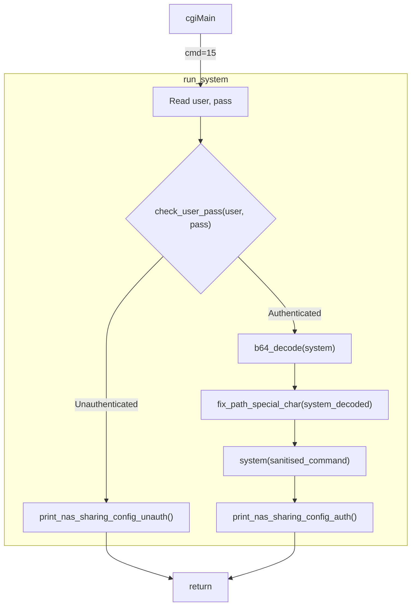

# Decompiled Functions

Related functions from binaries extracted from D-Link DNS-320L firmware version `$VERSION` and decompiled with Ghidra.

Re-written for personal clarity, no guarantees of accuracy.

## Program flow



## `nas_sharing.cgi`

### `run_system()`

When `nas_sharing.cgi` receives `cmd=15` it runs this function, which is responsible for executing a bas64-encoded system command.

D-Link are very smart though, so they:
1. Ensure that a valid username & password are provided
2. Ensure that the command is sanitised - no funny business!!

```c
void run_system(void) {
  char s_system[4096];
  char s_system_b64[4096];
  char s_password[4096];
  char s_user[4100];
  
  memset(s_user, 0, 4096); // Hey - what about those last 4 bytes??
  memset(s_password, 0, 4096);
  memset(s_system_b64, 0, 4096);
  memset(s_system, 0, 4096);

  // Read in the username/password from user/id1
  cgiFormString("user", s_user, 4096);
  cgiFormString("passwd", s_password, 4096);  // Yes, send me your plaintext password over port 80 in a GET request please
  if(s_user[0] == '\0' && s_password[0] == '\0') {
    cgiFormString("id1", s_user, 4096);
    cgiFormString("id2", s_password, 4096);
  }

  cgiFormString("system", s_system_b64, 4096);
  if(check_user_pass(s_user,s_password) == 0) {
    // Not authenticated, bye
    print_nas_sharing_config_unauth();
  } else {
    // OK, definitely authenticated! SAFE!
    b64_decode(s_system, s_system_b64, strlen(s_system_b64));
    fix_path_special_char(s_system); // NO NASTY CHARACTERS! OK, well some are allowed.
    system(s_system); // This call is the target of our patching - replace with NOPs
    print_nas_sharing_config_auth();
  }
  return;
}
```

## `libsmbif.so`

### `fix_path_special_char()`

Detects certain special characters and attempt to escape them by inserting a `\` before it.

Problems:
- Because `IFS` allows splitting on tabs or newlines, and this only strips spaces.
- `|` is omitted, so you could chain commands with `||` instead of `;`
- There's an exploitable buffer overflow

```c
void fix_path_special_char(char *cmd) {
  char s_sanitised[4096];
  memset(s_sanitised, 0, 4096);

  if( strchr(cmd, '$') || strchr(cmd, '`') || strchr(cmd, '#') || strchr(cmd, '%') || 
        strchr(cmd, '^') || strchr(cmd, '&') || strchr(cmd, '(') || strchr(cmd, ')') || 
        strchr(cmd, '+') || strchr(cmd, '{') || strchr(cmd, '}') || strchr(cmd, ';') || 
        strchr(cmd, '[') || strchr(cmd, ']') || strchr(cmd, '\'')|| strchr(cmd, '=') || 
        strchr(cmd, ' ') ) {

    uint offset = 0;
    size_t len_cmd = strlen(cmd);
    int i = 0;
    if (len_cmd != 0) {
      do {
        char c = cmd[offset];
        if (c == '`' || c == '$' || c == '#' || c == '%' || c == '^' || c == '&' || 
            c == '(' || c == ')' || c == '+' || c == '{' || c == '}' || c == ';' || 
            c == '[' || c == ']' || c == '\'' || c == '=' || c == ' ') {
          s_sanitised[i++] = '\\';
        }
        s_sanitised[i++] = c;
        len_cmd = strlen(cmd);
        offset++;
      } while (offset < len_cmd);
    }
    strcpy(cmd, s_sanitised); /*    Overflowable. Only 4k is allocated, but no checks here (ie. no snprintf).
                                    4096 bytes of b64 system are read, which is 3072 decoded characters.
                                    If you make 2048 of these chars one of the above invalid chars then the 
                                    escape '\' characters will eat up the entire buffer, leaving plenty for ROP.
                                    This is kinda pointless here, because we can system() anyway, but other areas
                                    of the firmware may use this function, which we could abuse.
                              */
  }
  return;
}
```

## `libsafe_system.cgi`

Library containing a "safe" system execution wrapper and a "safe" command execution wrapper.

Safe from a memory corruption vulnerability perspective, but not from a code execution vulnerability perspective.

This library is used by the following URLs:
- `/cgi-bin/nas_sharing.cgi` - 200
- `/cgi-bin/network_mgr.cgi` - 404
- `/cgi-bin/addon_center.cgi` - 404
- `/cgi-bin/account_mgr.cgi` via the following commands (all authenticated):
    - cgi_create_import_users
    - cgi_user_batch_create
    - cgi_group_add
    - cgi_user_add
    - cgi_group_del
    - cgi_group_modify
    - cgi_user_modify
    - cgi_user_modify
    - cgi_chg_admin_pw_mdb
    - cgi_chg_admin_pw
    - cgi_user_del
    - cgi_get_modify_group_info
    - cgi_get_modify_user_info
- `/cgi-bin/webdav_mgr.cgi` - 404
- `/cgi-bin/usb_device.cgi` - 404
- `/cgi-bin/gui_mgr.cgi` - 404
- `/cgi-bin/mydlink.cgi` - 200
    - cmd=123, user=messagebus, pwd='', volume param is passed to `scandisk`
- `/cgi-bin/wizard_mgr.cgi` - 404
- `/cgi-bin/mydlink_account_mgr.cgi` - 404
- `/cgi-bin/myMusic.cgi` - 404
- `/cgi-bin/system_mgr.cgi` - 404
- `/cgi-bin/photocenter_mgr.cgi` - 404
- `/cgi-bin/login_mgr.cgi` - 500
- `/cgi-bin/webfile_mgr.cgi` - 404
- `/cgi-bin/mydlink_sync_mgr.cgi` - 200


### `safe_system()`

```c
// Safe system execution wrapper
int safe_system(char* command, char* stdout_file, char* stderr_file, char** args) {
    // Allocate initial array for command and arguments (128 * 4 bytes)
    char** cmd_args = (char**)calloc(128, sizeof(char*));
    if (cmd_args == NULL) {
        return -1;
    }

    // Store the command as first argument
    cmd_args[0] = command;

    // Copy additional arguments if provided
    if (args != NULL) {
        int arg_count = 1;
        int current_size = 128;
        size_t total_size = 520; // 0x208 initial size

        // Copy all arguments
        while (*args != NULL) {
            cmd_args[arg_count] = *args;
            args++;
            arg_count++;

            // Reallocate if we need more space
            if (arg_count >= current_size) {
                cmd_args = (char**)realloc(cmd_args, total_size);
                if (cmd_args == NULL) {
                    return -1;
                }
                // Clear new memory
                memset(&cmd_args[arg_count], 0, 512);
                current_size += 128;
            }
            total_size += sizeof(char*);
        }
    }

    // Execute command safely
    int result = safe_exec(cmd_args[0], cmd_args, stdout_file, stderr_file, 1);
    free(cmd_args);
    return result;
}
```

### `safe_exec()`

```c
// Safe command execution with proper signal handling
int safe_exec(char* command, char** args, char* stdout_file, char* stderr_file, int wait_flag) {
    // If no command provided, check if /bin/sh is executable
    if (command == NULL) {
        uint access_result = access("/bin/sh", X_OK);
        return (access_result < 2) ? (1 - access_result) : 0;
    }

    // Set up signal handlers
    struct sigaction sig_int, sig_quit, sig_chld;
    struct sigaction old_int, old_quit, old_chld;
    sigset_t sig_mask, old_mask;

    // Setup SIGINT handler
    sig_int.__sigaction_handler.sa_handler = SIG_IGN;
    sigemptyset(&sig_int.sa_mask);
    sig_int.sa_flags = 0;

    // Install signal handlers
    if (sigaction(SIGINT, &sig_int, &old_int) == -1) {
        return -1;
    }
    if (sigaction(SIGQUIT, &sig_int, &old_quit) == -1) {
        sigaction(SIGINT, &old_int, NULL);
        return -1;
    }

    // Setup SIGCHLD handler if not waiting
    if (!wait_flag) {
        sig_chld.__sigaction_handler.sa_handler = SIG_IGN;
        sigemptyset(&sig_chld.sa_mask);
        sig_chld.sa_flags = 0;
        if (sigaction(SIGCHLD, &sig_chld, &old_chld) == -1) {
            sigaction(SIGINT, &old_int, NULL);
            sigaction(SIGQUIT, &old_quit, NULL);
            return -1;
        }
    }

    // Block SIGCHLD
    sigemptyset(&sig_mask);
    sigaddset(&sig_mask, SIGCHLD);
    if (sigprocmask(SIG_BLOCK, &sig_mask, &old_mask) == -1) {
        sigaction(SIGINT, &old_int, NULL);
        sigaction(SIGQUIT, &old_quit, NULL);
        if (!wait_flag) {
            sigaction(SIGCHLD, &old_chld, NULL);
        }
        return -1;
    }

    // Fork process
    pid_t pid = fork();
    if (pid == -1) {
        // Fork failed, restore signals and return
        sigaction(SIGINT, &old_int, NULL);
        sigaction(SIGQUIT, &old_quit, NULL);
        if (!wait_flag) {
            sigaction(SIGCHLD, &old_chld, NULL);
        }
        sigprocmask(SIG_SETMASK, &old_mask, NULL);
        return -1;
    }

    if (pid == 0) {  // Child process
        // Restore original signal handlers
        sigaction(SIGINT, &old_int, NULL);
        sigaction(SIGQUIT, &old_quit, NULL);
        if (!wait_flag) {
            sigaction(SIGCHLD, &old_chld, NULL);
        }
        sigprocmask(SIG_SETMASK, &old_mask, NULL);

        // Setup stdout redirection if requested
        if (stdout_file != NULL) {
            int fd = creat(stdout_file, 0644);  // 0x1a4 = 0644
            if (fd == -1) {
                return -1;
            }
            dup2(fd, STDOUT_FILENO);
            close(fd);
        }

        // Setup stderr redirection if requested
        if (stderr_file != NULL) {
            int fd = creat(stderr_file, 0644);
            if (fd == -1) {
                return -1;
            }
            dup2(fd, STDERR_FILENO);
            close(fd);
        }

        // Set secure PATH environment variable
        putenv("PATH=/sbin:/usr/sbin:/bin:/usr/bin:/usr/local/sbin");
        
        // Execute command
        execvp(command, args);
        _exit(127);  // Command not found
    }

    // Parent process
    if (!wait_flag) {
        // Don't wait for child
        sigaction(SIGINT, &old_int, NULL);
        sigaction(SIGQUIT, &old_quit, NULL);
        sigprocmask(SIG_SETMASK, &old_mask, NULL);
        return 0;
    }

    // Wait for child process
    int status = -1;
    while (1) {
        pid_t result = waitpid(pid, &status, 0);
        if (result != -1) break;
        if (errno != EINTR) break;
    }

    // Restore signal handlers
    sigaction(SIGINT, &old_int, NULL);
    sigaction(SIGQUIT, &old_quit, NULL);
    sigprocmask(SIG_SETMASK, &old_mask, NULL);

    return status;
}
```