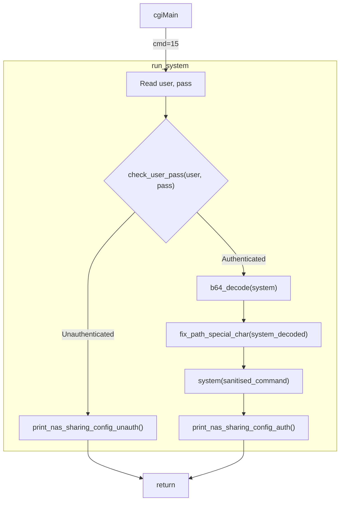

# Decompiled Functions

Related functions from binaries extracted from D-Link DNS-320L firmware version `$VERSION` and decompiled with Ghidra.

Re-written for personal clarity, no guarantees of accuracy.

## Program flow



## `nas_sharing.cgi`

### `run_system()`

When `nas_sharing.cgi` receives `cmd=15` it runs this function, which is responsible for executing a bas64-encoded system command.

D-Link are very smart though, so they:
1. Ensure that a valid username & password are provided
2. Ensure that the command is sanitised - no funny business!!

```c
void run_system(void) {
  char s_system[4096];
  char s_system_b64[4096];
  char s_password[4096];
  char s_user[4100];
  
  memset(s_user, 0, 4096); // Hey - what about those last 4 bytes??
  memset(s_password, 0, 4096);
  memset(s_system_b64, 0, 4096);
  memset(s_system, 0, 4096);

  // Read in the username/password from user/id1
  cgiFormString("user", s_user, 4096);
  cgiFormString("passwd", s_password, 4096);  // Yes, send me your plaintext password over port 80 in a GET request please
  if(s_user[0] == '\0' && s_password[0] == '\0') {
    cgiFormString("id1", s_user, 4096);
    cgiFormString("id2", s_password, 4096);
  }

  cgiFormString("system", s_system_b64, 4096);
  if(check_user_pass(s_user,s_password) == 0) {
    // Not authenticated, bye
    print_nas_sharing_config_unauth();
  } else {
    // OK, definitely authenticated! SAFE!
    b64_decode(s_system, s_system_b64, strlen(s_system_b64));
    fix_path_special_char(s_system); // NO NASTY CHARACTERS! OK, well some are allowed.
    system(s_system);
    print_nas_sharing_config_auth();
  }
  return;
}
```

## `libsmbif.so`

### `fix_path_special_char()`

Detects certain special characters and attempt to escape them by inserting a `\` before it.

Problems:
- Because `IFS` allows splitting on tabs or newlines, and this only strips spaces.
- `|` is omitted, so you could chain commands with `||` instead of `;`
- There's an exploitable buffer overflow

```c
void fix_path_special_char(char *cmd) {
  char s_sanitised[4096];
  memset(s_sanitised, 0, 4096);

  if( strchr(cmd, '$') || strchr(cmd, '`') || strchr(cmd, '#') || strchr(cmd, '%') || 
        strchr(cmd, '^') || strchr(cmd, '&') || strchr(cmd, '(') || strchr(cmd, ')') || 
        strchr(cmd, '+') || strchr(cmd, '{') || strchr(cmd, '}') || strchr(cmd, ';') || 
        strchr(cmd, '[') || strchr(cmd, ']') || strchr(cmd, '\'')|| strchr(cmd, '=') || 
        strchr(cmd, ' ') ) {

    uint offset = 0;
    size_t len_cmd = strlen(cmd);
    int i = 0;
    if (len_cmd != 0) {
      do {
        char c = cmd[offset];
        if (c == '`' || c == '$' || c == '#' || c == '%' || c == '^' || c == '&' || 
            c == '(' || c == ')' || c == '+' || c == '{' || c == '}' || c == ';' || 
            c == '[' || c == ']' || c == '\'' || c == '=' || c == ' ') {
          s_sanitised[i++] = '\\';
        }
        s_sanitised[i++] = c;
        len_cmd = strlen(cmd);
        offset++;
      } while (offset < len_cmd);
    }
    strcpy(cmd, s_sanitised); /*    Overflowable. Only 4k is allocated, but no checks here (ie. no snprintf).
                                    4096 bytes of b64 system are read, which is 3072 decoded characters.
                                    If you make 2048 of these chars one of the above invalid chars then the 
                                    escape '\' characters will eat up the entire buffer, leaving plenty for ROP.
                                    This is kinda pointless here, because we can system() anyway, but other areas
                                    of the firmware may use this function, which we could abuse.
                              */
  }
  return;
}
```